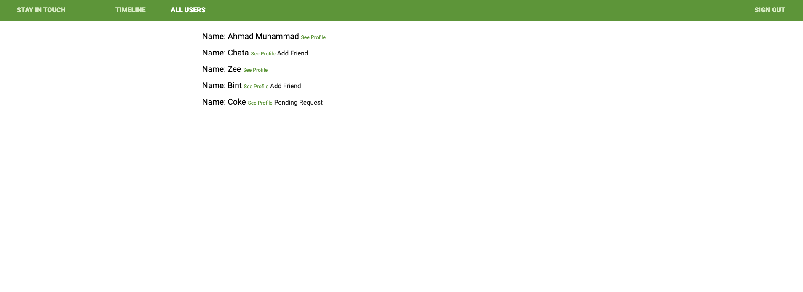

# Social media

> This a social media website. Users can send friend requests to other users, post and comment on posts

## Built With

- Ruby v2.7.2
- Ruby on Rails v5.2.4

## Screenshot



## Live Demo
[Live demo](https://salty-stream-05643.herokuapp.com/)


## Getting Started

To get a local copy up and running follow these simple example steps.

### Prerequisites

Ruby: 2.6.3
Rails: 5.2.3
Postgres: >=9.5

### Setup

Instal gems with:

```
bundle install
```

Setup database with:

```
   rails db:create
   rails db:migrate
```

### Usage

Start server with:

```
    rails server
```

Open `http://localhost:3000/` in your browser.

### Run tests

```
    rpsec --format documentation
```

## Authors
👤 **Ahmad Chata**

- Github: [Ahmad Chata](https://github.com/ahmadchata)
- Twitter: [@ahmadchata](https://twitter.com/ahmadchata)
- Linkedin: [Ahmad Chata](https://www.linkedin.com/in/ahmadchata/)

## 🤝 Contributing

Contributions, issues and feature requests are welcome!

Feel free to check the [issues page](issues/).

## Show your support

Give a ⭐️ if you like this project!

## Acknowledgments
- Microverse
- Social Media repository: [Repo Link](https://github.com/microverseinc/ror-social-scaffold)

## 📝 License

TBA

